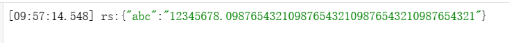

# 关于JSON

> MarmotScript 中共包含三种JSON,其行为模式不同，用途不同

***

## JSON 
```javascript
    //JavaScript默认JSON,存在大整数精度问题
    const str=JSON.stringify(object);
    const newObject=JSON.parse(str);
```
***
## SAFE_JSON
```javascript
    //由引擎提供的SAFE_JSON,主要用于引擎和外部世界的交互，将所有数字自动处理为字符串
    const {JSON}=require('@M/v1/safe-json');//注意，该语法会局部覆盖JSON
    const SAFE_JSON=require('@M/v1/safe-json').JSON; //更安全
    const str=SAFE_JSON.stringify(object);
    const newObject=SAFE_JSON.parse(str);
    let rs = "{\"abc\":12345678.0987654321098765432109876543210987654321}"
    STD.Logger.info("rs:{}",SAFE_JSON.parse(rs));
```
注：已支持反序列化小数超10位的数值，上述代码输出日志为


## JSONBig
```javascript
    //流行的可解决大整数问题的改进版JSON(非EcmaScript标准)
    //常用于代替默认JSON
    const JSONBig=require('json-bigint');
    const str=JSONBig.stringify(object);
    const newObject=JSONBig.parse(str);
```