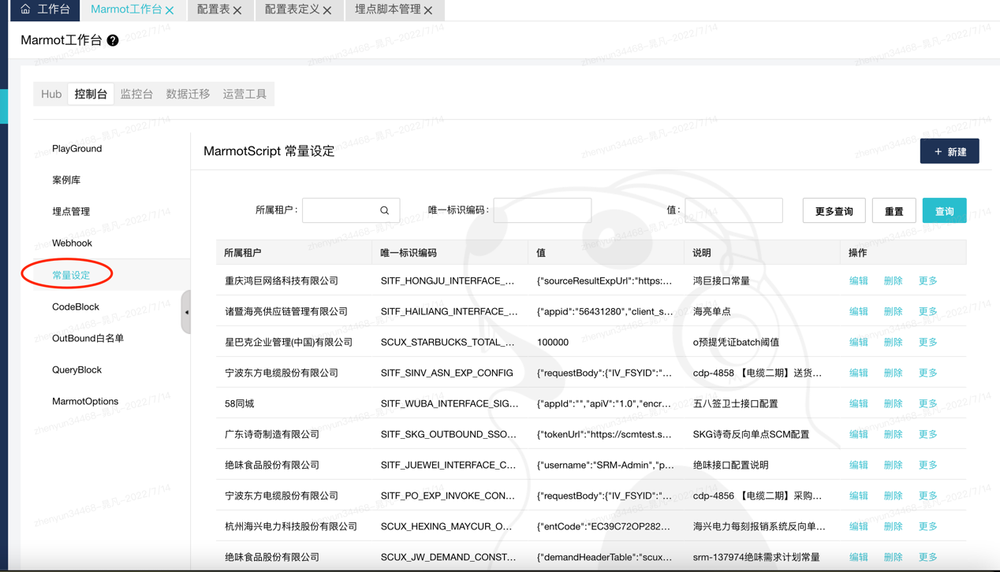

# constants
> summary: 系统常量获取工具，支持通过编码查询系统预置常量值
> 引用路径: @M/v1/constants
常量获取

**引入**
```javascript
let constants = require("@M/v1/constants");
```
***
### get
获取常量

| **参数名**         | **必输** | **类型** | **默认值** | **说明**      |
| --------------- | ------ | ------ | ------- | -------------------------- |
| code   | 是     | string | 空       | 常量编码 |

```javascript
constants.get({code:"constant_code"});
```
***

# 常量位置：

