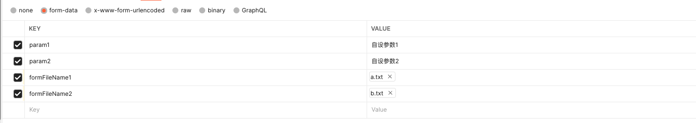

# Attachment
> summary: 文件工具，提供上传、下载、拉取文件信息等功能，支持UUID管理和外部存储
> 引用路径: @M/v1/attachment

文件工具，提供上传、下载、拉取文件信息等功能。

引用路径 ： @M/v1/attachment

## 目录

* [生成文件uuid---getAttachmentUUID](#生成文件uuid)
* [通过uuid获得文件列表---fetchServiceFilesByUUID](#通过uuid获得文件列表)
* [通过fileUrl获得单个文件信息---fetchServiceFileByUrl](#通过fileurl获得单个文件信息)
* [通过fileUrl获得文件buffer---fetchBufferByFile](#通过fileurl获得文件buffer)
* [获取文件授权URL---getSignedUrl](#获取文件授权URL)
* [上传buffer到某uuid---uploadToAttachment](#上传buffer到某uuid)
* [上传base64到某uuid---uploadToAttachment](#上传base64到某uuid)
* [上传buffer到外部对象存储---uploadToTenantStorage](#上传buffer到外部对象存储)
* [上传base64到外部对象存储---uploadToTenantStorageBase64](#上传base64到外部对象存储)
* [批量上传文件到外部url---uploadAttachmentByUrl](#批量上传文件到外部url)
* [从外部url下载并上传到内部---uploadFromExternalUrl](#从外部url下载并上传到内部)
* [根据url删除文件---deleteFileByUrl](#根据url删除文件)
* [根据fileUrl复制附件---cloneAttachmentByUrl](#根据fileUrl复制附件)
* [根据fileUrl复制附件到指定UUID---copyByUrlToUuid](#根据fileUrl复制附件到指定UUID)
* [根据单个UUID复制附件---cloneAttachment](#根据单个uuid复制附件)
* [根据UUID数组批量复制附件到一个uuid---cloneAttachmentToSingleUuid](#根据UUID数组批量复制附件到一个uuid)
* [根据UUID数组批量复制附件到一个uuid（跨租户）---cloneAttachmentToSingleUuidCrossTenant](#根据uuid数组批量复制附件到一个uuid跨租户)
* [根据UUID数组复制附件,每个uuid对应一个新的uuid---batchCloneAttachment](#根据UUID数组复制附件,每个uuid对应一个新的uuid)
* [解压文件---decompressFiles](#解压文件)
* [打包文件成zip---zipBuffers](#打包文件成zip)
***

## 通过uuid获得文件列表

#### 描述

*   通过已知的文件uuid查询文件服务器上的文件信息列表
*   使用的是文件客户端的getAttachmentFiles方法，即文件服务API：/v1/{organizationId}/files/{attachmentUUID}/file

#### 名称

*   fetchServiceFilesByUUID

#### 入参

| **参数名**    | **必输** | **类型** | **默认值**        | **说明** |
| ---------- | ------ | ------ | -------------- | ------ |
| uuid       | 是      | string | 空              | 文件uuid |
| bucketName | 否      | string | private-bucket | 桶名称    |

#### 使用示例

```javascript
function process(input) {

  let attachment = require("@M/v1/attachment");
  
  //默认都使用private-bucket,可手动指定桶
  //uuid获得文件列表
  let files = attachment.fetchServiceFilesByUUID({uuid: "0f639b8434d0d4f2cb0d76648dbc52c8f"});
  
  return { result: files };
}


```

#### 返回结果示例

```json
{
  "result" : [ 
  {
    "fileUrl" : "https://isrm-dev-private-bucket.obs.cn-east-2.myhuaweicloud.com:443/marmot_template_management/0/30d316de45d34b4f9e877608741d7e28@永祥结算单发票打印模板7 (2).rtf",
    "fileType" : "application/msword",
    "fileName" : "永祥结算单发票打印模板7 (2).rtf",
    "fileSize" : "7066404",
    "bucketName" : "private-bucket",
    "creationDate" : "2022-03-10 16:12:56",
    "createdBy" : "495692",
    "loginName" : "zhenyun34442",
    "realName" : "孙静涛"
    }
 ]
}
```

***

## 通过fileUrl获得单个文件信息

#### 描述

*   通过已知的文件url查询文件服务器上的单个文件信息
*   使用的是文件客户端的getFiles方法，即文件服务API：/v1/{organizationId}/files

#### 名称

*   fetchServiceFileByUrl

#### 入参

| **参数名**    | **必输** | **类型** | **默认值**        | **说明** |
| ---------- | ------ | ------ | -------------- |--------|
| fileUrl    | 是      | string | 空              | 文件url  |
| bucketName | 否      | string | private-bucket | 桶名称    |

#### 使用示例

```javascript
function process(input) {

  let attachment = require("@M/v1/attachment");
  
  //默认都使用private-bucket,可手动指定桶
  //fileUrl获得文件信息
  let file = attachment.fetchServiceFileByUrl({fileUrl: "https://isrm-dev-private-bucket.obs.cn-east-2.myhuaweicloud.com:443/marmot_template_management/0/30d316de45d34b4f9e877608741d7e28@永祥结算单发票打印模板7 (2).rtf"});
  return { result: file };
}


```

#### 返回结果示例

```json
{
  "result" : 
  {
    "fileUrl" : "https://isrm-dev-private-bucket.obs.cn-east-2.myhuaweicloud.com:443/marmot_template_management/0/30d316de45d34b4f9e877608741d7e28@永祥结算单发票打印模板7 (2).rtf",
    "fileType" : "application/msword",
    "fileName" : "永祥结算单发票打印模板7 (2).rtf",
    "fileSize" : "7066404",
    "bucketName" : "private-bucket",
    "creationDate" : "2022-03-10 16:12:56",
    "createdBy" : "495692",
    "loginName" : "zhenyun34442",
    "realName" : "孙静涛"
  }
}


```

***

## 通过fileUrl获得文件buffer

#### 描述

*   通过已知的文件url查询文件服务器，并获得文件bytes\[]
*   查询使用的是文件客户端的getFiles方法，即文件服务API：/v1/{organizationId}/files
*   下载使用的是文件客户端的downloadFile方法，即文件服务API：/v1/{organizationId}/files/download/inner

#### 名称

*   fetchBufferByFile

#### 入参

| **参数名**    | **必输** | **类型** | **默认值**        | **说明** |
| ---------- | ------ | ------ | -------------- |--------|
| fileUrl    | 是      | string | 空              | 文件url  |
| bucketName | 否      | string | private-bucket | 桶名称    |
| format | 否      | string | bytes | 格式     |


#### 使用示例

```javascript
function process(input) {

  let attachment = require("@M/v1/attachment");
  
  //默认都使用private-bucket,可手动指定桶;format值有两种:bytes和base64
  //fileUrl获得文件信息
  let fileBytes = attachment.fetchBufferByFile({fileUrl: "https://isrm-dev-private-bucket.obs.cn-east-2.myhuaweicloud.com:443/marmot_template_management/0/30d316de45d34b4f9e877608741d7e28@永祥结算单发票打印模板7 (2).rtf"});
  //注意：获得的bytes如果需要后续操作(比如excel转成workbook或者提供下载)，需要主动进行 fileBytes = Buffer.from(fileBytes) 的转换
    
  return { result: fileBytes };
}


```

#### 返回结果示例

```json
{
  "result" : [123, 92, 114, 116, 102, 49, 92, 97, 100, 101, 102, 108, 97, 110, 103, 49, 48, 50, 53, 92, 97, 110, 115, 105, 92, 97, 110, 115, 105, 99, 112, 103, 57, 51, 54, 92, 117, 99, 50, 92, 97, 100.........]
}
 //此处为文件buffer 过长 不建议打印 建议配合uploadToAttachment等方法使用


```

***

## 上传buffer到某uuid

#### 描述

*   上传buffer到指定的uuid，buffer 必须是Java 支持的 有符号 byte 组成的 byte\[]
*   若无uuid参数，则使用的文件客户端的getAttachmentUUID方法生成新的uuid，文件服务API：/v1/{organizationId}/files/uuid
*   上传使用的是文件客户端的uploadAttachment方法，文件服务API：/v1/{organizationId}/files/attachment/byte

#### 名称

*   uploadToAttachment

#### 入参

| **参数名**    | **必输** | **类型**  | **默认值**        | **说明**    |
| ---------- | ------ | ------- | -------------- |-----------|
| buffer     | 是      | byte\[] | 空              | 文件buffer  |
| fileName   | 是      | string  | 空              | 文件名(注意后缀) |
| uuid       | 是      | string  | 空              | 指定的uuid   |
| bucketName | 否      | string  | private-bucket | 桶名称       |

#### 使用示例

```javascript
function process(input) {

  let attachment = require("@M/v1/attachment");
  
  //默认都使用private-bucket,可手动指定桶
  //fileUrl获得文件信息
  let fileBytes = attachment.fetchBufferByFile({fileUrl: "https://isrm-dev-private-bucket.obs.cn-east-2.myhuaweicloud.com:443/marmot_template_management/0/30d316de45d34b4f9e877608741d7e28@永祥结算单发票打印模板7 (2).rtf"});
  
  //上传 注意filename里需要带上文件后缀名
  let testUpload=attachment.uploadToAttachment({
    buffer:fileBytes,fileName:'test12123.jpg',uuid:'0eb8facf933b64e6fb4fe9c5f1b9feab9'
  });
 
  return { result: testUpload };
}


```

#### 返回结果示例

```json
{
  "result" : "https://isrm-dev-private-bucket.obs.cn-east-2.myhuaweicloud.com:443/30/182cc56908e44c46a761fb2ddd0cb995@test12123"
}
```
***

## 上传base64到某uuid

#### 描述

*   上传base64到指定的uuid，大文件尽量使用该方式，避免使用buffer占用大量内存
*   若无uuid参数，则使用的文件客户端的getAttachmentUUID方法生成新的uuid，文件服务API：/v1/{organizationId}/files/uuid
*   上传使用的是文件客户端的uploadAttachment方法，文件服务API：/v1/{organizationId}/files/attachment/byte

#### 名称

*   uploadToAttachmentBase64

#### 入参

| **参数名**    | **必输** | **类型** | **默认值**        | **说明**    |
|------------| ------ |--------| -------------- |-----------|
| base64     | 是      | string | 空              | 文件base64  |
| fileName   | 是      | string | 空              | 文件名(注意后缀) |
| uuid       | 是      | string | 空              | 指定的uuid   |
| bucketName | 否      | string | private-bucket | 桶名称       |

#### 使用示例

```javascript
function process(input) {

  let attachment = require("@M/v1/attachment");
  
  //默认都使用private-bucket,可手动指定桶
  //fileUrl获得文件信息
  let fileBase64 = attachment.fetchBufferByFile({fileUrl: "https://isrm-dev-private-bucket.obs.cn-east-2.myhuaweicloud.com:443/marmot_template_management/0/30d316de45d34b4f9e877608741d7e28@永祥结算单发票打印模板7 (2).rtf",
  format:'base64'});
  
  //上传 注意filename里需要带上文件后缀名
  let testUpload=attachment.uploadToAttachmentBase64({
    base64:fileBase64,fileName:'test12123.jpg',uuid:'0eb8facf933b64e6fb4fe9c5f1b9feab9'
  });
 
  return { result: testUpload };
}


```

#### 返回结果示例

```json
{
  "result" : "https://isrm-dev-private-bucket.obs.cn-east-2.myhuaweicloud.com:443/30/182cc56908e44c46a761fb2ddd0cb995@test12123"
}
```

***

## 上传buffer到外部对象存储

#### 描述

*   上传buffer到外部对象存储，buffer 必须是Java 支持的 有符号 byte 组成的 byte\[]
*   上传使用的是文件服务的SDK方法
*   需要在平台层 文件存储配置 定义客户对象存储，指定存储编码进行上传
*   不建议使用该方案，几乎所有对象存储都支持临时授权链接，建议优先使用临时授权上传到客户自己的对象存储系统

#### 名称

*   uploadToTenantStorage

#### 入参

| **参数名**     | **必输** | **类型**  | **默认值** | **说明**    |
|-------------|--------| ------- |---------|-----------|
| storageCode | 是      | string  | 空       | 指定对象存储编码  |
| buffer      | 是      | byte\[] | 空       | 文件buffer  |
| fileName    | 是      | string  | 空       | 文件名(注意后缀) |
| bucketName  | 是      | string  | 空       | 桶名称       |
| directory   | 是      | string  | 空       | 桶名称       |
#### 使用示例

```javascript
function process(input) {

  let attachment = require("@M/v1/attachment");
  
 
  //上传 注意filename里需要带上文件后缀名
  let testUpload=attachment.uploadToTenantStorage({
      storageCode:'test-storage',
      buffer:fileBytes,fileName:'test12123.jpg',
      bucketName:'private-bucket',directory:'/test'
  });
 
  return { result: testUpload };
}


```

#### 返回结果示例

```json
{
  "result" : "https://isrm-dev-private-bucket.obs.cn-east-2.myhuaweicloud.com:443/30/182cc56908e44c46a761fb2ddd0cb995@test12123"
}
```

***

## 上传base64到外部对象存储

#### 描述

*   上传base64到指定的uuid，大文件尽量使用该方式，避免使用buffer占用大量内存
*   上传使用的是文件服务的SDK方法
*   需要在平台层 文件存储配置 定义客户对象存储，指定存储编码进行上传
*   不建议使用该方案，几乎所有对象存储都支持临时授权链接，建议优先使用临时授权上传到客户自己的对象存储系统

#### 名称

*   uploadToTenantStorageBase64

#### 入参

| **参数名**     | **必输** | **类型**  | **默认值** | **说明**    |
|-------------|--------| ------- |---------|-----------|
| storageCode | 是      | string  | 空       | 指定对象存储编码  |
| base64        | 是      | byte\[] | 空       | 文件buffer  |
| fileName    | 是      | string  | 空       | 文件名(注意后缀) |
| bucketName  | 是      | string  | 空       | 桶名称       |
| directory   | 是      | string  | 空       | 桶名称       |
#### 使用示例

```javascript
function process(input) {

  let attachment = require("@M/v1/attachment");
  
 
  //上传 注意filename里需要带上文件后缀名
  let testUpload=attachment.uploadToTenantStorageBase64({
      storageCode:'test-storage',
      base64:fileBase64,fileName:'test12123.jpg',
      bucketName:'private-bucket',directory:'/test'
  });
 
  return { result: testUpload };
}


```

#### 返回结果示例

```json
{
  "result" : "https://isrm-dev-private-bucket.obs.cn-east-2.myhuaweicloud.com:443/30/182cc56908e44c46a761fb2ddd0cb995@test12123"
}
```


***

## 根据url获取文件信息

#### 描述

*   根据url获取文件信息
*   使用的是文件客户端的getFiles方法，即文件服务API：/v1/{organizationId}/files

#### 名称

fetchServiceFileByUrl

#### 入参

| **参数名**    | **必输** | **类型** | **默认值**        | **说明** |
| ---------- | ------ | ------ | -------------- |--------|
| fileUrl    | 是      | string | 空              | 文件url  |
| bucketName | 否      | string | private-bucket | 桶名称    |

#### 使用示例

```javascript
function process(input) {
    let result = attachment.fetchServiceFileByUrl({
        fileUrl : "https://isrm-dev-public.obs.cn-east-2.myhuaweicloud.com:443/0/47963cce8ccf495fbd7c03588cbadc22@favicon.ico",
        bucketName : "public"
    });
}


```

#### 返回结果示例

```json
{
  "result" : {
    "fileUrl" : "https://isrm-dev-public.obs.cn-east-2.myhuaweicloud.com:443/0/47963cce8ccf495fbd7c03588cbadc22@favicon.ico",
    "fileType" : "image/x-icon",
    "fileName" : "favicon.ico",
    "fileSize" : "1150",
    "bucketName" : "public",
    "creationDate" : "2019-09-09 19:35:19"
  }
}


```

#### 出参描述

| **参数名**    | **类型** | **说明** |
| ---------- | ------ |--------|
| fileUrl    | string | 文件url  |
| bucketName | string | 桶名称    |

***

## 根据单个UUID复制附件

#### 描述

*   根据UUID复制附件，会生成一个新的uuid
*   使用的是文件客户端的copyFile方法，即文件服务API：/v1/{organizationId}/files/copy-file

#### 名称

*   cloneAttachment

#### 入参

| **参数名**    | **必输** | **类型** | **默认值**        | **说明** |
| ---------- | ------ | ------ | -------------- | ------ |
| uuid       | 是      | string | 空              | 文件uuid |
| bucketName | 否      | string | private-bucket | 桶名称    |

#### 使用示例

```javascript
function process(input) {  
  let attachment = require("@M/v1/attachment")
  let res = attachment.cloneAttachment({uuid:"3071f9fa85dfe74b46adfcb6881bb6999a"})
  return { result:res };
}


```

#### 返回结果示例

```json
{
  "result" : {
  //此处 key是源uuid，value是新uuid
    "3071f9fa85dfe74b46adfcb6881bb6999a" : "30fd1a2e2cb08d4d7db23cb653dd4c50fe"
  }
}


```
***

## 根据fileUrl复制附件

#### 描述

*   根据fileUrl复制附件，返回新的url
*   使用的是文件客户端的copyFileByUrl方法，即文件服务API：/v1/{organizationId}/files/copy-by-url

#### 名称

*   cloneAttachmentByUrl

#### 入参

| **参数名**    | **必输** | **类型** | **默认值**        | **说明** |
| ---------- | ------ | ------ |----------------|--------|
| fileUrl       | 是      | string | 空              | 文件url  |
| sourceBucketName | 否      | string | private-bucket | 桶名称    |
| destinationBucketName | 否      | string | private-bucket | 桶名称    |
| destinationFileName | 否      | string | 空              | 新文件名称  |

#### 使用示例

```javascript
function process(input) {
    let attachment = require("@M/v1/attachment")
    let res = attachment.cloneAttachmentByUrl({fileUrl:"xxxxx",destinationFileName:"a.txt"})
    return { result:res };
}


```

#### 返回结果示例

```json
{
  "result" : "xxxxx"
}

```
***

## 根据fileUrl复制附件到指定UUID

#### 描述

*   根据fileUrl复制附件到指定的UUID中,支持修改文件名，支持逻辑或物理复制,物理复制返回新的url,逻辑复制返回源url
*   使用的是文件服务API：/v1/{organizationId}/files/copy-by-url-to-uuid

#### 名称

*   copyByUrlToUuid

#### 入参

| **参数名**    | **必输** | **类型**  | **默认值** | **说明**                       |
| ---------- | ------ |---------|---------|------------------------------|
| fileUrl       | 是      | string  | 空       | 文件url                        |
| bucketName       | 是      | string  | 空       | 桶名称                          |
| destinationUuid       | 是      | string  | 空       | 复制到的目标UUID                   |
| destinationBucketName | 否      | string  | 空       | 目标桶名称                        |
| destinationFileName | 否      | string  | 空       | 新文件名称                        |
| logicCopyFlag | 否      | boolean | false   | 逻辑复制标识,false代表物理复制,true为逻辑复制 |

#### 使用示例

```javascript
function process(input) {  
  let attachment = require("@M/v1/attachment")
  let res = attachment.copyByUrlToUuid({fileUrl:"xxxxx",bucketName:"private-bucket",destinationUuid:"065ff9cf7c8034fb2b6580531dc98d409",destinationFileName:"aa.txt"})
  return { result:res };
}


```

#### 返回结果示例

```json
{
  "result" : "xxxxx"
}


```
***

## 根据url删除文件

**描述**

*   根据url删除指定文件
*   使用的是文件客户端的deleteFile方法，即文件服务API：/v1/{organizationId}/files/delete-by-uuidurl

**名称**

*   deleteFileByUrl

**入参**

| **参数名**    | **必输** | **类型**       | **默认值**        | **说明** |
| ---------- | ------ | ------------ | -------------- |--------|
| uuid       | 是      | string       | 空              | 文件uuid |
| fileUrl    | 是      | string或array | 空              | 文件url  |
| bucketName | 否      | string       | private-bucket | 桶名称    |

#### 使用示例

```javascript
function process(input) {  
  let attachment = require("@M/v1/attachment")
  let res = attachment.deleteFileByUrl({
      uuid:"30440956ace46244d9995b36b01b7331e7",
      bucketName:"private-bucket",
      fileUrl:"https://isrm-dev-private-bucket.obs.cn-east-2.myhuaweicloud.com:443/30/2e8038b97bc74bfc8a9c9d6758b8899a@abc.txt"
  });
  return { result:res };
}

```


**返回结果示例**

```json
{
  "result" : null
}


```
***
## 打包文件成zip

**描述**

*   把多个文件打包成一个zip文件

**名称**

*   zipBuffers

**入参**

| **参数名**    | **必输** | **类型**       | **默认值**        | **说明** |
| ---------- | ------ | ------------ | -------------- | ------ |
| bufferMap       | 是      | object       | 空              | 文件名与buffer等映射 |


#### 使用示例

```javascript
function process(input) {  
  let attachment = require("@M/v1/attachment");
  let bmap = {
      "a.txt":bytes1,
      "b.png":bytes2,
      "c.png":bytes3
  };
  //打包文件成zip压缩包
  let bytes = attachment.zipBuffers({bytesMap:bmap});
  return { result:bytes };
}

```


**返回结果示例**

```json
{
  //文件buffer，过长不宜展示
  "result" : [80, 75, 3, 4, 20, 0, 8, 8, 8, 0, 66, -117, -35, 84, 0, 0, 0, 0......]
}


```
***
## 生成文件uuid

**描述**

*   生成一个经过处理的uuid
*   使用的是文件客户端的getAttachmentUUID方法，即文件服务API：/v1/{organizationId}/files/uuid

**名称**

*   getAttachmentUUID

#### 使用示例

```javascript
function process(input) {  
  let attachment = require("@M/v1/attachment");
  let uuid = attachment.getAttachmentUUID();
}
```
***
## 批量上传文件到外部url

**描述**

*   批量上传文件到外部url
*   下载文件的代码跟fetchBufferByFile方法类似
*   用post方式请求外部url，请求类型为：multipart/form-data

**名称**

*   uploadAttachmentByUrl

#### 使用示例
假设目标链接要求body如下图所示：

```javascript
function process(input) {  
  let attachment = require("@M/v1/attachment");
  let fileInfos = [
        {
            fileUrl:"https://isrm-dev-private-bucket.obs.cn-east-2.myhuaweicloud.com:443/30/8900d64127544957a76cef3f10011005@test.txt",
            bucketName:"private-bucket",
            fileStreamName:"formFileName1",
            fileName:"a.txt"
        },
        {
            fileUrl:"https://isrm-dev-private-bucket.obs.cn-east-2.myhuaweicloud.com:443/30/8900d64127544957a76cef3f10011005@test.txt",
            bucketName:"private-bucket",
            fileStreamName:"formFileName2",
            fileName:"b.txt"
        }];
  let uuid = attachment.uploadAttachmentByUrl({
        url:"外部链接", 
        fileInfos:fileInfos,
        headers:{
            Authorization:"token"
        },
        body:{
            "param1": "自设参数1",
            "param2": "自设参数2"
        }
        });
}
```

## 从外部url下载并上传到内部

**描述**

*   从外部 URL 下载文件并**流式直传**到内部附件服务（srm-file）
*   全程不经 JS Buffer、不经完整 byte[] 驻留——Java 侧流式下载响应流直接上传，**大文件内存占用恒定**
*   **替代** `STD.HttpClient.doGetAsBuffer(url, headers)` + `uploadToAttachment({buffer,...})` 组合：
    大文件以 JS Buffer 形态在脚本引擎内逐字节流转会产生海量中间对象（autoToInt8Array 转换），
    是脚本引擎 OOM 的常见根因（S038 MUSICTRIBE 119MB 图纸案例）。本方法仅需脚本传 URL，避免大文件进 JS。
*   **扩展（platform-8853）**：支持 **POST + body**（form-urlencoded / json / raw），
    覆盖需要携带 body 的外部下载接口（如嘉士伯 File/Download，curl `--data-urlencode` 场景）。
    缺省 method=GET、无 body，与原始版本完全向后兼容。
*   ⚠️ **出站白名单**：外部 URL 的 host 必须已加入出站白名单（`marmot_script_outbound_whitelist`），
    否则抛 `MarmotScript OutBound : Host [...] is not in outbound whitelist`
*   ⚠️ **大小限制**：超过 `FILE_MAX_SIZE` 抛 `scc.error_file_group_compress_upload`

**名称**

*   uploadFromExternalUrl

#### 入参

| **参数名** | **必输** | **类型** | **默认值** | **说明** |
| ---------- |--------| ------ |---------|---------|
| url        | 是      | string | 无        | 外部接口 URL（host 必须在出站白名单） |
| method     | 否      | string | GET      | HTTP 方法：GET / POST |
| bodyType   | 否      | string | form     | body 编码：form（x-www-form-urlencoded）/ json / raw（仅 POST 有效） |
| body       | 否      | object/string | 无 | body 内容（见下方示例） |
| fileName   | 否      | string | 响应头/URL推导 | 目标文件名 |
| uuid       | 否      | string | 自动生成   | 目标 uuid |
| bucketName | 否      | string | private-bucket | 目标桶 |
| directory  | 否      | string | script-default-directory | 目标目录 |
| headers    | 否      | object | {}       | 请求头，如 {Accept:'*/*', arena_session_id:'xxx'} |

#### 使用示例（GET，外部图纸下载）

```javascript
function process(input) {
  let attachment = require("@M/v1/attachment");
  
  // 下载外部图纸/文件并直传内部（大文件安全，不经 JS Buffer）
  let fileUrl = attachment.uploadFromExternalUrl({
      url: "https://api.europe.arenaplm.com/v1/files/N5P8D2Y0QP8O7QGC13GB/content",
      fileName: "drawing.zip",
      uuid: input.uuid,                        // 可选，缺省自动生成
      headers: { Accept: "*/*", arena_session_id: "xxx" }  // 可选鉴权头
  });
  STD.Logger.info("上传结果:{}", fileUrl);     // 返回 fileUrl（与 uploadToAttachment 一致）
}
```

#### 使用示例（POST + form，嘉士伯 File/Download）

```javascript
function process(input) {
  let attachment = require("@M/v1/attachment");

  // 对应 curl：
  // curl --location --request POST 'https://uat-cnai.carlsberg.cn/ekb/Api/Workspace/File/Download' \
  //   --data-urlencode 'id=4610868437009301504' \
  //   --data-urlencode 'objectType=2' \
  //   --data-urlencode 'Authorization=eyJhbGciOiJIUzI1NiIs...'
  let fileUrl = attachment.uploadFromExternalUrl({
      url: "https://uat-cnai.carlsberg.cn/ekb/Api/Workspace/File/Download",
      method: "POST",
      bodyType: "form",                        // x-www-form-urlencoded（对应 curl --data-urlencode）
      body: {
          id: "4610868437009301504",
          objectType: "2",
          Authorization: "eyJhbGciOiJIUzI1NiIs..."   // 嘉士伯把 token 放 body 字段里
      },
      fileName: "carlsberg-file.pdf"           // 返回的 PDF 文件
  });
  STD.Logger.info("上传结果:{}", fileUrl);     // 返回内部附件 fileUrl
}
```

#### 返回结果示例

```json
"https://isrm-prod-private-bucket.obs.cn-east-2.myhuaweicloud.com:443/script-default-directory/431858/9f8e7d6c5b4a3210@drawing.zip"
```
***


## 获取文件授权URL

**描述**

*   获取文件授权URL
*   使用的是文件客户端的getSignedUrl方法，即文件服务API：/v1/{organizationId}/files/signedUrl

**名称**

*   getSignedUrl

#### 入参

| **参数名**    | **必输** | **类型** | **默认值** | **说明**  |
| ---------- |--------| ------ |---------|---------|
| bucketName | 是      | string | 无       | 桶名称     |
| storageCode | 否      | string | 无       | 存储配置编码     |
| url       | 是      | string | 无       | 文件url   |
| expires | 否      | string | 10s     | 过期时间（秒） |

#### 使用示例

```javascript

let signedUrl = attachment.getSignedUrl({
    bucketName: "private-bucket",
    url: "https://isrm-dev-private-bucket.obs.cn-east-2.myhuaweicloud.com:443/rel_folder/0/e1f54558d7164ea685e1e24d3f822a9a@暂收款申请单V3.rtf"
})

```
***


## 根据UUID数组批量复制附件到一个uuid

#### 描述

*   根据UUID数组复制附件，会生成一个新的uuid
*   直接调用文件服务API：/v1/{organizationId}/files/copy-file

#### 名称

*   cloneAttachmentToSingleUuid

#### 入参

| **参数名**    | **必输** | **类型** | **默认值**        | **说明** |
| ---------- | ------ | ------ | -------------- | ------ |
| uuids       | 是      | array | []              | 文件uuid数组 |
| bucketName | 否      | string | private-bucket | 桶名称    |
| targetUuid | 否      | string | 无 | 目标uuid    |

#### 使用示例

```javascript
function process(input) {  
  let attachment = require("@M/v1/attachment")
  let res = attachment.cloneAttachmentToSingleUuid({uuids:["304727fd6555fc495cb4bb52231e415638","304ea8d35d426d4b0eab6192113fc3566e"]})
  return { result:res };
}


```

#### 返回结果示例

```json
{
  "result" : {
  //此处 key是源uuid，value是新uuid
    "304ea8d35d426d4b0eab6192113fc3566e" : "3061a3a0062273470fac5ffba035fd0b54",
    "304727fd6555fc495cb4bb52231e415638" : "3061a3a0062273470fac5ffba035fd0b54"
 }
}
```

***

## 根据UUID数组批量复制附件到一个uuid（跨租户）
#### 描述

*   根据UUID数组复制附件，会生成一个新的uuid，uuid数组所属的租户可以和当前租户不同，通常为供应商和采购方的关系
*   请谨慎使用，确定需要跨租户复制场景再使用
*   直接调用文件服务API：/v1/{organizationId}/files/copy-file

#### 名称

*   cloneAttachmentToSingleUuidCrossTenant
*   使用方式和[根据UUID数组批量复制附件到一个uuid---cloneAttachmentToSingleUuid](#根据UUID数组批量复制附件到一个uuid)相同


## 根据UUID数组复制附件,每个uuid对应一个新的uuid

#### 描述

*   根据UUID数组复制附件,每个uuid对应一个新的uuid
*   使用的是文件客户端的copyFile方法，即文件服务API：/v1/{organizationId}/files/copy-file

#### 名称

*   batchCloneAttachment

#### 入参

| **参数名**    | **必输** | **类型** | **默认值**        | **说明** |
| ---------- | ------ | ------ | -------------- | ------ |
| uuids       | 是      | array | []              | 文件uuid数组 |
| bucketName | 否      | string | private-bucket | 桶名称    |

#### 使用示例

```javascript
function process(input) {  
  let attachment = require("@M/v1/attachment")
  let res = attachment.batchCloneAttachment({uuids:["304727fd6555fc495cb4bb52231e415638","304ea8d35d426d4b0eab6192113fc3566e"]})
  return { result:res };
}


```

#### 返回结果示例

```json
{
  "result" : {
  //此处 key是源uuid，value是新uuid
    "304ea8d35d426d4b0eab6192113fc3566e" : "307fd47a3a7f154819bd63b3f42268fb5d",
    "304727fd6555fc495cb4bb52231e415638" : "3063a61bc6d561481497f71bd921ef5132"
 }
}
```

***

## 解压文件

**描述**

*   解压压缩文件（如zip），返回解压后的新附件UUID
*   支持格式：zip、7z
*   限制：
    *   压缩包大小 ≤ 50MB
    *   解压后总文件大小 ≤ 500MB
    *   单个解压文件数量有限制，规避文件炸弹攻击
*   使用的是文件服务API：/v1/{organizationId}/files/decompress

**名称**

*   decompressFiles

**入参**

| **参数名**       | **必输** | **类型** | **默认值** | **说明** |
| -------------- | ------ | ------ |---------|---------|
| attachmentUuid | 是      | string | 无       | 需要解压的附件UUID |

#### 使用示例

```javascript
function process(input) {  
  let attachment = require("@M/v1/attachment")
  let newUuid = attachment.decompressFiles({attachmentUuid: "3071f9fa85dfe74b46adfcb6881bb6999a"});
  return { result: newUuid };
}
```

#### 返回结果示例

```json
{
  "result" : "30fd1a2e2cb08d4d7db23cb653dd4c50fe"
}
```
