# Messenger
> summary: 消息发送组件，支持站内信、邮件、短信、MQ外部系统多种渠道发送
> 引用路径: @M/v1/messenger

消息发送组件
* [发送消息（包括站内信、邮件等）](#发送消息包括站内信邮件等)
* [发送带有附件的邮件](#发送带有附件的邮件)
* [发送带有多个附件的邮件](#发送带有多个附件的邮件)
* [消息发送设置流程](#消息发送设置流程)
  * [消息模版配置](#消息模版配置)
    *[配置变量和可变表格](#配置变量和可变表格)
  * [消息发送配置](#消息发送配置)
  * [如何指定接收组](#如何指定接收组)
  * [邮箱配置](#邮箱配置)
  * [短信配置](#短信配置)
  * [脚本发送消息](#脚本发送消息)
  * [消息发送结果查询](#消息发送结果查询)
# 发送消息（包括站内信、邮件等）

**描述**

*   在脚本中使用MessageHelper发送消息

**名称**

*   sendMessage

**入参**

| **参数名**         | **必输** | **类型**  | **默认值** | **说明**                   |
|-----------------|--------|---------|---------|--------------------------|
| sendConfigObj   | 是      | string  | 空       | 发送参数，具体参考SpfmMessageSender |
| useReceiveGroup | 否      | boolean | false   | 是否使用【消息接收者类型设置】中的配置      |
| tx              | 否      | boolean | false   | 是否发saga消息                |

**使用示例**

```javascript
function process(input) {
  let messageHelper = require("@M/v1/messenger")
  let userList = [
    {
      //iam_user中的userid 换成自己的点debug 就能收到站内信了
      userId: 124937,
      email:"1234@going-link.com", 
      phone:"123456789",
      targetUserTenantId: 0
    }
  ];

  let bodyList = [{ title: "tt", name: "hh", content: "123" }];
  
  let param = {
    tenantId: 0,
    messageCode: "DIFFERENT_CODE_CHECK_EMAIL",
    // 传多语言参数一般指定不了模板的多语言---消息语言取的是接收人配置的当前语言，如果没有获取到接收人的设置语言才会取这个参数的值
    // lang: "en_US",     
    receiverAddressList: userList,
    args: {
      serviceName: "srm-adaptor",
      msg: "777777777777777"
    },
    objectArgs: {
      infoList: bodyList
    },
    //非必输，可不传
    typeCodeList: ["WEB","EMAIL","SMS","MQ"]     //WEB-站内信 ，EMAIL-邮箱 ，SMS-短信， MQ-外部系统 
  };
    messageHelper.sendMessage(param);
    //使用【消息接收者类型设置】中的配置参数位置如下
    //messageHelper.sendMessage(param, true);
  return { input };
}


```
备注：  
1.debug的时候【`tx = true`】不会生效  
2.邮箱和短信发送均需配置白名单
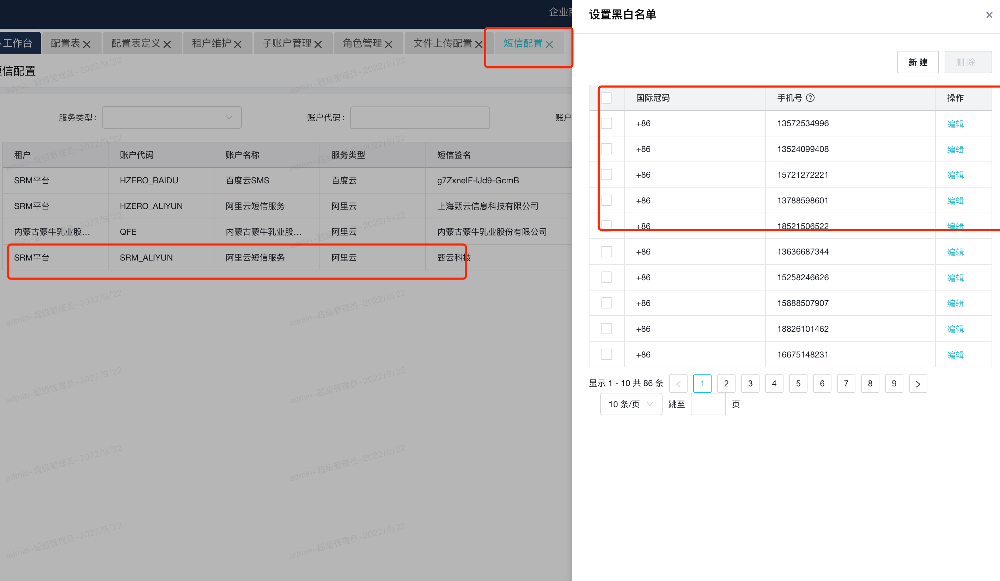
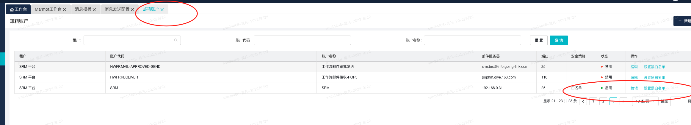
***

# 发送带有附件的邮件

**描述**

*   在脚本中使用MessageHelper发送带有附件的邮件

**名称**

*   sendMessageInAttachment

**入参**

| **参数名**         | **必输** | **类型** | **默认值** | **说明**                     |
| --------------- | ------ | ------ | ------- | -------------------------- |
| sendConfigObj   | 是      | string | 空       | 发送参数，具体参考SpfmMessageSender |
| useReceiveGroup | 否      | string | false   | 是否使用【消息接收者类型设置】 中的配置              |
| file            | 是      | bytes  | 空       | 文件流                        |
| fileName        | 是      | string | 文件名     | 需要带格式，比如.pdf .xlsx         |

**使用示例**

```javascript
function process( input ){
    //关于RTF填充的培训内容请参考  https://lexiangla.com/attachments/ab7efae26e1e11ecbf54f2ce4dd74be6?company_from=d8d18c5a850c11eab17f5254002f1020
  //引入hub支持包
   let hub = require("@M/v1/hub");
  let obj = {
    //hub 中的模板编码
    templateCode : "ASN_PRINT_QR_CODE",
    //对应的参数
    param : {"asnHeaderId" : 4}
  }
  //关于RTF填充的培训内容请参考  https://lexiangla.com/attachments/ab7efae26e1e11ecbf54f2ce4dd74be6?company_from=d8d18c5a850c11eab17f5254002f1020
  
  let bytes = hub.generateTemplatedPDF(obj)
  //引入MessageHelper
  let messageHelper = require("@M/v1/messenger")
  //改成自己的
  let userList = [
    {
      email:"695111053@qq.com"
    }
  ];

  //如果要使用接收人设置，需要在args里添加接受组调用接口的所需参数 并使用sendMessage方法
  //如果想直接屏蔽掉接收设置，可以自己写Queryblock查出对应的信息，并使用STD.PlatformMessage.sendMessageNoReceiverGroup  参数一致
  let param = {
    tenantId: 0,
    messageCode: "DIFFERENT_CODE_CHECK_EMAIL",
    receiverAddressList: userList,
    typeCodeList: ["EMAIL"]
  };
  messageHelper.sendMessageInAttachment(param,{file:bytes,fileName:"导出测试文件2.pdf"},false);
   return { "result":"ok"};
}


```

***

# 发送带有多个附件的邮件

**描述**

*   在脚本中使用MessageHelper发送带有多个附件的邮件

**名称**

*   sendMessageInAttachments

**入参**

| **参数名**         | **必输** | **类型** | **默认值** | **说明**                     |
| --------------- | ------ | ------ | ------- | -------------------------- |
| sendConfigObj   | 是      | string | 空       | 发送参数，具体参考SpfmMessageSender |
| useReceiveGroup | 否      | string | false   | 是否使用【消息接收者类型设置】中的配置 |
| arr             | 是      | \[]    | 空       | 需要放入{file,fileName}        |

**使用示例**

```javascript
function process( input ){
    //关于RTF填充的培训内容请参考  https://lexiangla.com/attachments/ab7efae26e1e11ecbf54f2ce4dd74be6?company_from=d8d18c5a850c11eab17f5254002f1020
    //引入hub支持包
    let hub = require("@M/v1/hub");
    let obj = {
        //hub 中的模板编码
        templateCode : "ASN_PRINT_QR_CODE",
        //对应的参数
        param : {"asnHeaderId" : 4}
    }
    //关于RTF填充的培训内容请参考  https://lexiangla.com/attachments/ab7efae26e1e11ecbf54f2ce4dd74be6?company_from=d8d18c5a850c11eab17f5254002f1020

    let bytes = hub.generateTemplatedPDF(obj)
    //引入MessageHelper
    let messageHelper = require("@M/v1/messenger")
    //改成自己的
    let userList = [
        {
            email:"695111053@qq.com"
        }
    ];

    //如果要使用接收人设置，需要在args里添加接受组调用接口的所需参数 并使用sendMessage方法
    //如果想直接屏蔽掉接收设置，可以自己写Queryblock查出对应的信息，并使用STD.PlatformMessage.sendMessageNoReceiverGroup  参数一致
    let param = {
        tenantId: 0,
        messageCode: "DIFFERENT_CODE_CHECK_EMAIL",
        receiverAddressList: userList,
        typeCodeList: ["EMAIL"]
    };
    let arr = []
    arr.push({file:bytes,fileName:"导出测试文件1.pdf"})
    arr.push({file:bytes,fileName:"导出测试文件2.pdf"})
    messageHelper.sendMessageInAttachments(param,arr,false);
    return { "result":"ok"};
}


```
***
# 消息发送设置流程

## 消息模版配置
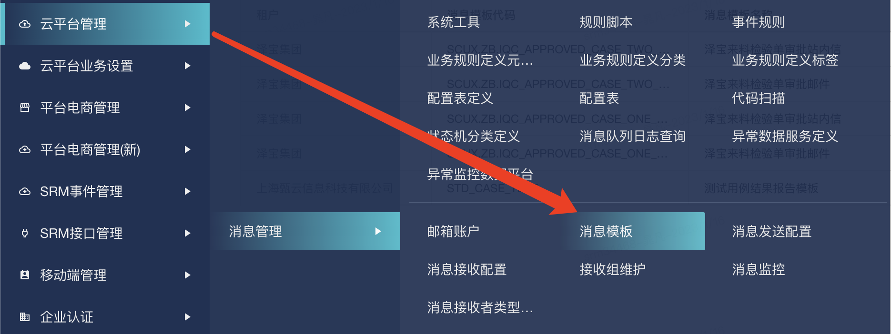

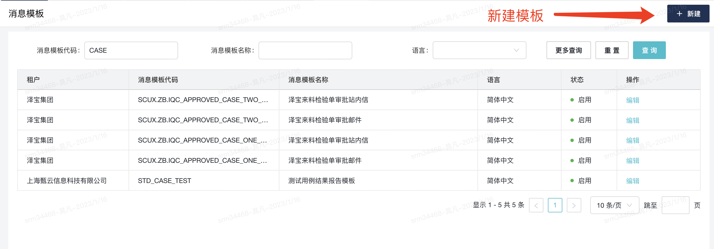
#### 配置变量和可变表格
变量(脚本参数args,参数需求都是字符串)
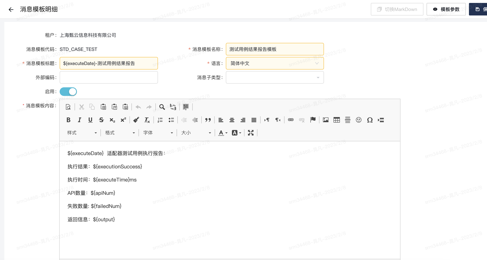
可变表格(脚本参数objectArgs,参数需求是对象、数组)
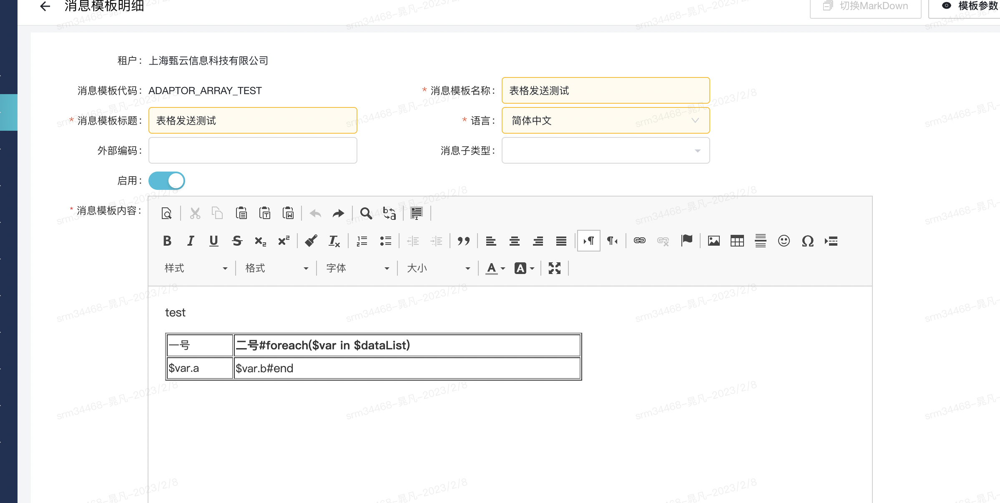
## 消息发送配置

### 1. 新建消息发送配置

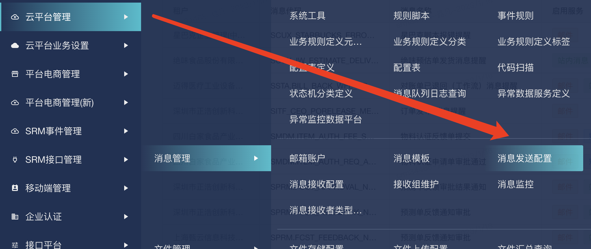

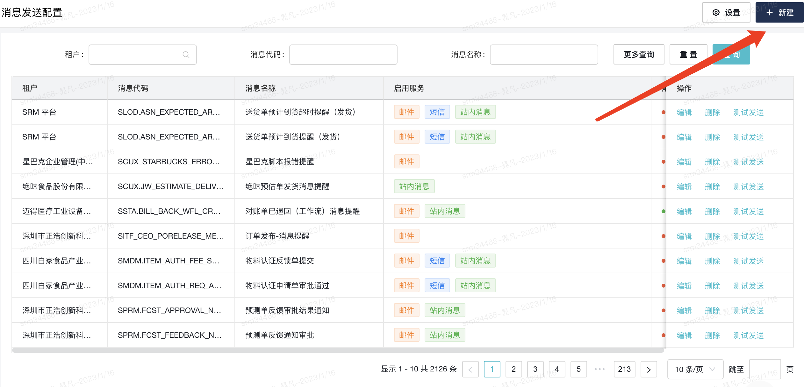
### 2. 指定消息模版

>指定对应模版后才能发送消息
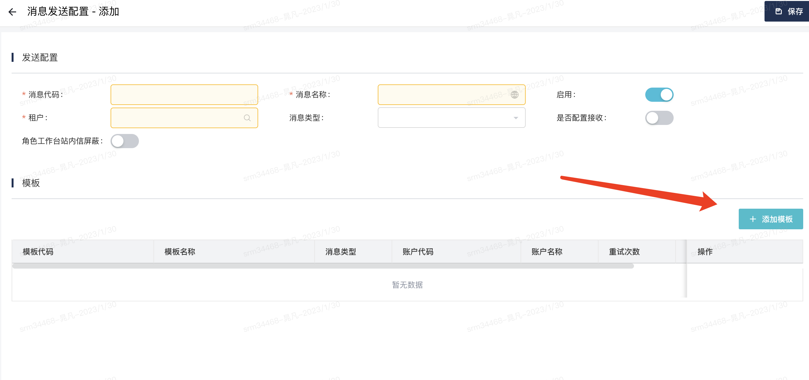
## 如何指定接收组

1.消息发送配置接收
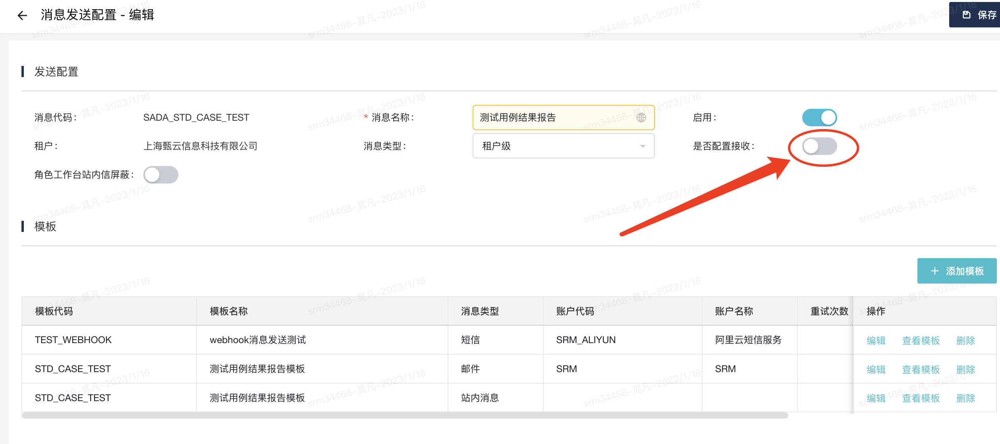
2.配置接收组
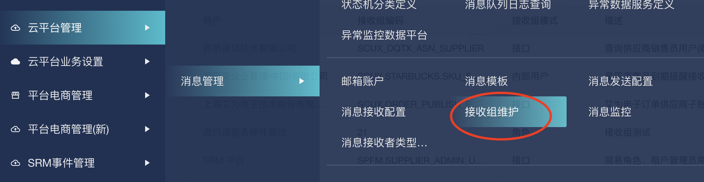
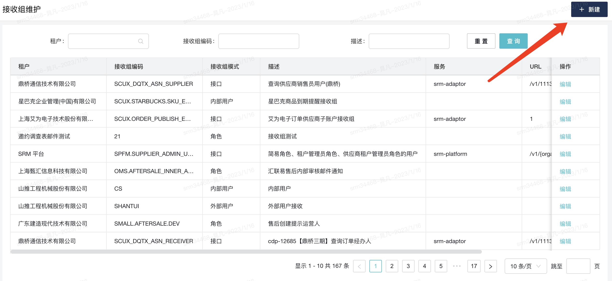
3.关联接收组与消息
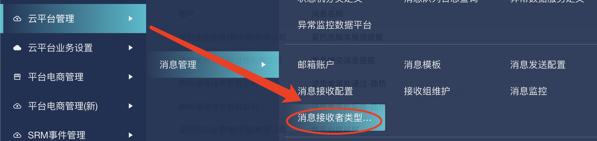
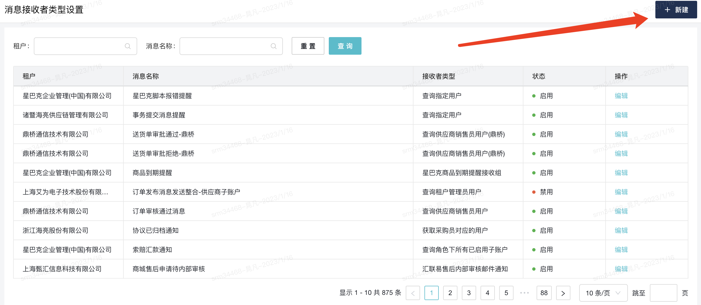

## 邮箱配置

1.邮箱账户与白名单配置(如果账号没有权限请找平台组)

2.消息发送邮箱配置
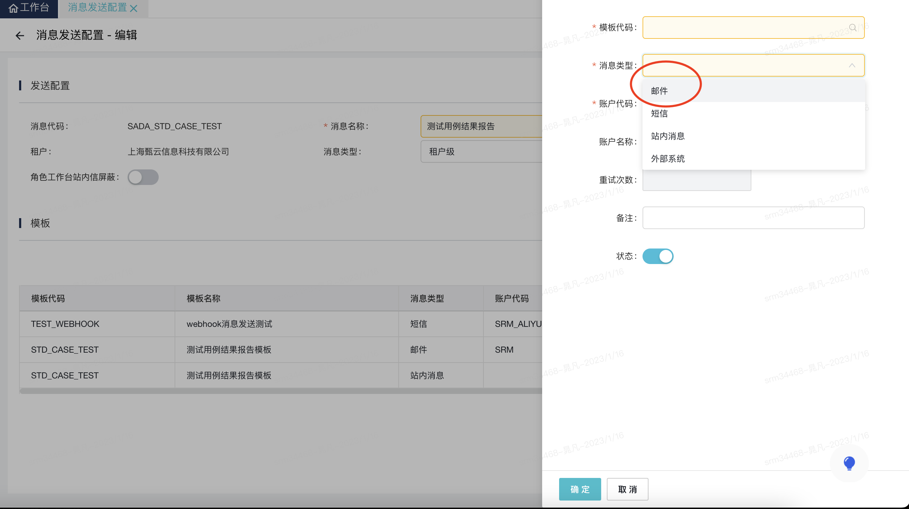

## 短信配置

1.短信白名单配置(如果账号没有权限请找平台组)

2.消息发送短信配置
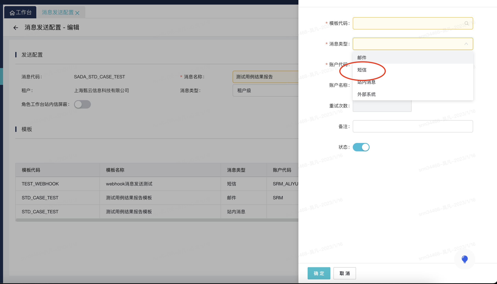

## 脚本发送消息

```javascript
let messageHelper = require("@M/v1/messenger");
let param = {
    tenantId: 0,
    messageCode: "SADA_STD_CASE_TEST",
    receiverAddressList: [{ 
        userId: "496015" , 
        targetUserTenantId:30 , //站内信必须
        email:"1234@going-link.com" ,   //邮箱必须
        phone:"123456789"   //短信必须
    }],
    lang: "zh_CN",
    args: {
        executeDate:"12",
        executionSuccess:"1",
        executeTime:"1",
        apiNum:"12",
        failedNum:"12",
        output:"12"
    },
    typeCodeList: ["WEB","EMAIL","SMS"],
    ccList: ["4567@going-link.com"] //仅邮箱，抄送人
};
messageHelper.sendMessage(param);
//使用【消息接收者类型设置】中的配置参数位置如下
//messageHelper.sendMessage(param, true);
```
## 消息发送结果查询

>消息监控位置
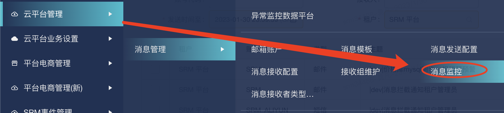

>这里可以查看消息发送是否成功，以及消息失败原因
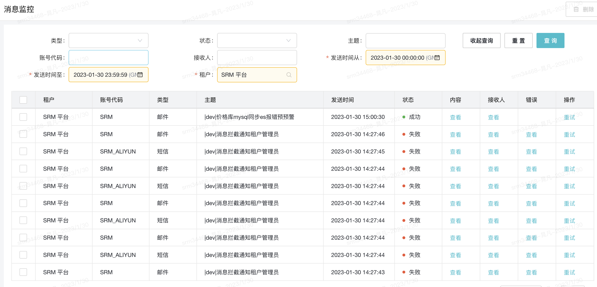