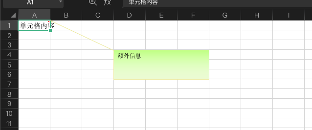
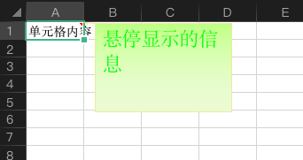
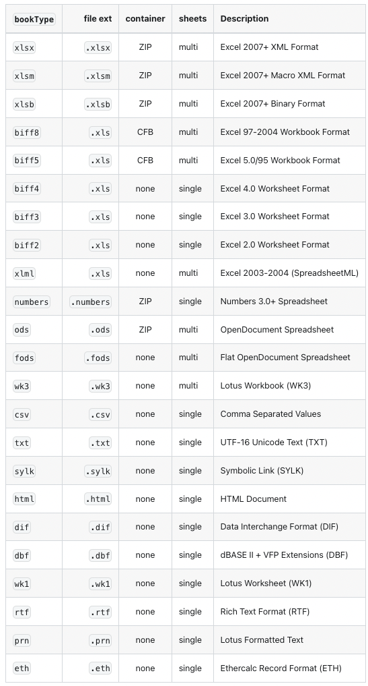

# JSSheet-Excel进阶开发

JSSheet是脚本中引入用于excel开发的node模块。

进阶开发使用了jssheet-pro版本的一些功能

在进行EXCEL进阶开发前，你需要引入以下模块：

```json
let XLSX = require("@sheet/core");  //替换之前的XLSX和XLSX_STYLE模块
let xlsx_support = require("@M/v1/xlsx-support/pro");

```
## 目录
* [1.下拉列表](#1.下拉列表)
* [2.表格保护](#2.表格保护)
* [3.单元格comment(示例：鼠标悬停显示额外内容)](#3.单元格comment)
* [4.输出格式变化](#4.输出格式变化)
* [附1：style样式对象](#附1：style样式对象)
### 1.下拉列表

#### 示例：

```javascript
let XLSX = require("@sheet/core");
//生成展示表
let ws = XLSX.utils.aoa_to_sheet([[]]);
//生成工作簿对象
let wb = XLSX.utils.book_new();
//展示表导入工作簿对象，并设置下拉列表
XLSX.utils.book_append_sheet(wb, ws, "sheet1");
//设置A1到E1单元格有下拉框，框内数值为1,2,3,4,5
ws['!validations'] = [
  {
    ref: 'A1:E1',
    t: 'List',
    l: ["1", "2", "3", "4", "5"]
  }
];
```
### 2.表格保护

#### 示例：

```javascript
//设置表格锁定
ws["!protect"] = {
    psssword: "123"		//可以不设密码
  };
//设置单元格可编辑
ws["A1"].s = {
    editable: true
  };
//设置单元格的公式隐藏
ws["B1"].s = {
    hidden: true
};
```
#### 其它参数

worksheet['!protect'] ：写入数据表保护属性的对象。`password`键为支持密码保护的数据表(XLSX/XLSB/XLS)指定密码。写入函数会使用XOR模糊方式。下面`key`控制数据表保护--数据表被锁定时设置key为false可以使用feature，或者设为true禁用feature。

| key                   | feature (true=disabled / false=enabled) | default  |
| --------------------- | --------------------------------------- | -------- |
| `selectLockedCells`   | 保护单元格可选                    | enabled  |
| `selectUnlockedCells` | 非保护单元格可选                   | enabled  |
| `formatCells`         | 单元格样式修改                            | disabled |
| `formatColumns`       | 列样式修改                         | disabled |
| `formatRows`          | 行样式修改                             | disabled |
| `insertColumns`       | 允许插入列                          | disabled |
| `insertRows`          | 允许插入行                             | disabled |
| `insertHyperlinks`    | 允许插入超链接                       | disabled |
| `deleteColumns`       | 允许删除列                          | disabled |
| `deleteRows`          | 允许删除行                             | disabled |
| `sort`                | 排序                                    | disabled |
| `autoFilter`          | 自动筛选                                  | disabled |
| `pivotTables`         | 使用数据透视表                     | disabled |
| `objects`             | 编辑对象                            | enabled  |
| `scenarios`           | 编辑方案                            | enabled  |
### 3.单元格comment
为单元格添加额外内容,使用方式为为单元格添加 c 属性。c类型为数组，内容为comment对象。

#### c数组属性：

| key                   | feature | default  |
| --------------------- | --------------------------------------- | --------------------- |
| `hidden`   | 是否隐藏(true则鼠标悬停到对应单元格上才显示)                    | false  |
| `!pos`   | comment位置                    |   |

#### comment对象属性：

| key                   | feature | default  |
| --------------------- | --------------------------------------- | --------------------- |
| `a`   | 作者                    |   |
| `t`   | 无格式默认文本                    |   |
| `R`   | 带样式内容数组，内容对象类型同单元格                   |   |

#### !pos对象属性

| key | interpretation                                          |
|:----|:--------------------------------------------------------|
| `r` | 左上角行坐标                    |
| `c` | 左上角列坐标                   |
| `x` | 距离左上角x轴距离 (类似于margin) |
| `y` | 距离左上角y轴距离 |
| `R` | 右下角行坐标                    |
| `C` | 右下角列坐标                    |
| `X` | 距离右下角x轴距离 |
| `Y` | 距离右下角轴距离 |
| `w` | 宽 (单位：pixels,与右下角位置不兼容)                                          |
| `h` | 高 (单位：pixels,与右下角位置不兼容)                                         |

#### 示例（额外信息指定位置展示）


```javascript
ws = utils.aoa_to_sheet([["单元格内容"]]);
ws["A1"].c = [{
    a:"2",
    t:"额外信息"
}];
ws["A1"].c["!pos"] = {
    r:3,c:3,
    R:6,C:6
};
```

#### 示例（鼠标悬停显示额外信息）：


```javascript
ws = utils.aoa_to_sheet([["单元格内容"]]);
ws["A1"].c = [];
ws["A1"].c.push({
    a:"2",
    R:[{t:"s",v:"悬停显示的信息",s:{sz:18,color:{rgb:"#00FF00"}}}]
});
ws["A1"].c.hidden=true;
```
***

### 4.输出格式变化

#### 示例

```javascript
let bytes = XLSX.write(wb, { type: "buffer", cellStyles: true, bookType:"xlsm" });
```

#### bookType格式




***
### 附1：style样式对象
   
```json
let style = {
  //字体
  bold:true,    //加粗
  italic:true,  //倾斜
  underline:1,  //下划线，1单线2双线
  sz:12,       //字号
  name::"宋体",  //字体
  color:{rgb : "000FFF"},  //文字颜色
  //对齐
  alignment: {
    horizontal: "center",  //水平
    vertical: "center",    //垂直
    wrapText: true         //自动换行
  },
  //背景
  fgColor:{rgb : "000FFF"},  //主背景色
  patternType:"solid",       //次背景色类型
  bgColor:{rgb : "000FFF"},  //次背景色
  //边框
  top : {style : "thin"},
  bottom : {style : "hair", color : { rgb: 0xFF0000}},
  left : {style : "medium", color : { auto : 1}},
  right : {style : "double", color : { rgb: 0xFF0000}}
  //加密保护
  hidden: true,    //保护时隐藏公式
  editable:true    //保护时可编辑
};
```