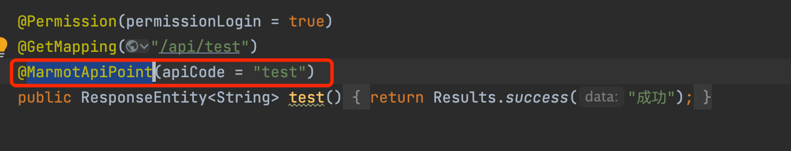
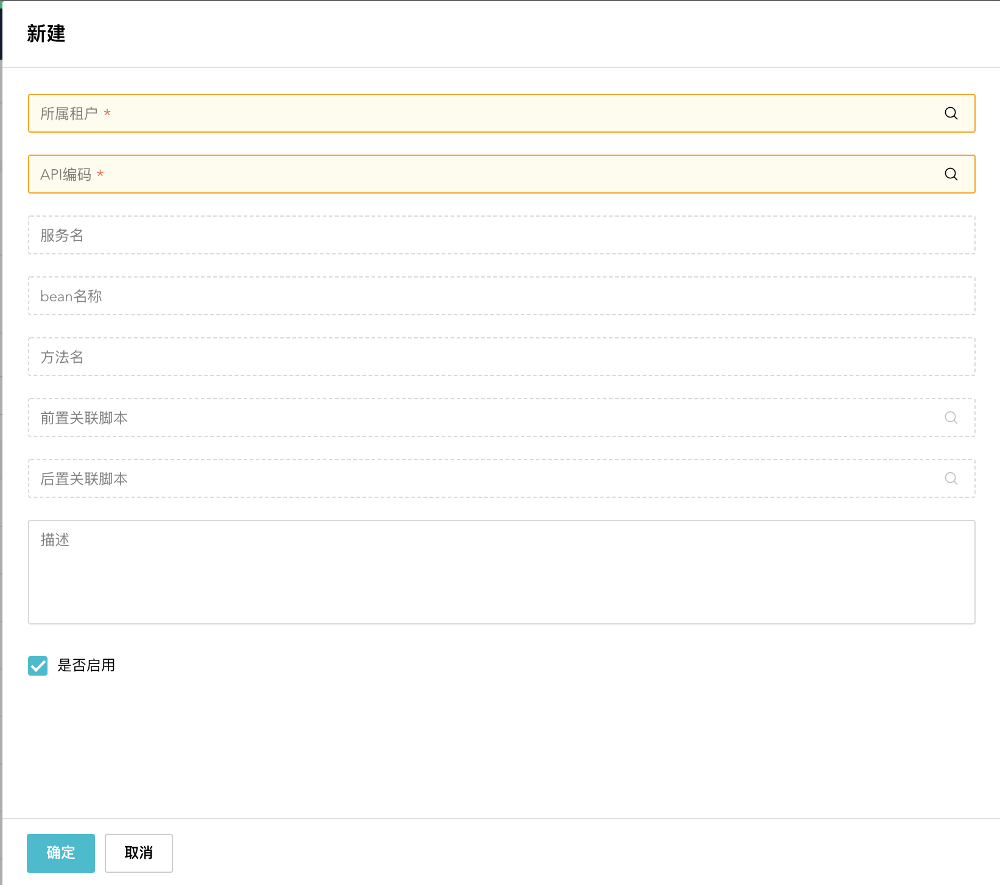

# 简介
功能API挂载，对Controller接口进行前置、后置的处理或填充逻辑。
## 注意
1. 功能API后置挂载支持对接口返回的response进行修改，其中包括header和body。  
2. 功能API前置挂载支持对接口入参request进行修改，其中包括parameters和body。  
3. 需注意，前置/后置脚本各自独立事务，并与原api三者互相隔离，可做数据更新，但无一致性。前置/后置逻辑做与原api有事务一致性的需求时不能使用该功能。(API功能挂载与API发布，在脚本编写上类似)。  
4. `@MarmotApiPoint`禁止与`@ExcelExport`同一个接口共同使用。报错信息如下：  
   `ExcelExport与MarmotApiPoint禁止用于同一个接口，apiCode:test`  
5. apiCode需根据URL进行创建，将/转成_，并大写。  
   例如：  
   - url：`https://dev.isrm.going-link.com/marmot/v1/30/marmot-api-rewrite/api/test`
     (取其中`/marmot/.../marmot-api-rewrite/api/test`部分)
   - apiCode：MARMOT_MARMOT-API-REWRITE_API_TEST
# 功能API挂载适用场景
API前置的覆盖需求范围：
1. 页面提交请求校验
2. 新增参数
3. 存储前变更数据
## 实现方式
土拨鼠API挂载：配置关联接口中`MarmotApiPoint`注解中的apiCode。
# 开发说明
## API关联配置
### 第一步：接口配置
    

添加注解`@MarmotApiPoint`即可
注意：
1. 现阶段仅支持继承了BaseController的接口类
2. apiCode需保证全局唯一，如果编写的code重复，spring boot启动时会报错。报错信息：`marmot api code of marmot api rewrite can not repeated`。
### 第二步：功能API挂载配置
    

1.选择该配置关联的租户  
2.API编码选择接口注解上配置的apiCode。（如果未找到请等待10秒）  
3.前置关联脚本，使用脚本改写或校验接口的入参信息（request中的parameters或body）  
4.后置关联脚本，使用脚本改写接口的返回信息（ response中的header或body）  
4.描述信息：带上需求号  
注意：该配置租户+API编码校验唯一。所以多个租户共用同一个apiCode，一个接口仅能有一个apiCode。
### 第三步脚本编写
#### 前置脚本编写
##### 脚本入参包括
```javascript
{
    "body":"{\"bodyTest\":\"test\"}",
    "parameter":Object{...},
    "header":Object{...},
    "method":"GET",
    "requestURI":"/v1/30/rel-table-records/"
}
```
`body`、`parameter`、`header`、`method`、`requestURI`皆为`request`中信息

##### 脚本返回参数编写

```javascript
return {
    "parameter":{
        "test":"test"
    },
    "body":"{\"bodyTest\":\"test\"}"
}
```
可以直接返回input脚本入参，当然只会改写parameter和body  
`body`用于修改接口的`response body`，需要转换成String再进行return（切忌重复转String）  

#### 后置脚本编写
##### 脚本入参包括
```javascript
{
    "body":"{\"bodyTest\":\"test\"}",
    "parameter":Object{...},
    "header":Object{...},
    "method":"GET",
    "requestURI":"/v1/30/rel-table-records/",
    "responseBody":"{\"userName\":\"wyf\"}"
}
```
1. `body`、`parameter`、`header`、`method`、`requestURI`皆为`request`中信息  
2. `responseBody`为接口的返回值  
3. `body`以及`responseBody`是字符串，使用的时候请使用`STD.SAFE_JSON.parse(str)`或者`JSONbig.parse(str)`再或者`xml2Json(content)`转化成`JSON`后使用。  
##### 脚本返回参数编写

```javascript
return {
    "header":{
        "test":"test"
    },
    "body":"{\"bodyTest\":\"test\"}"
}
```
1. `header`用于添加接口的`response header`。如果不需要添加header，可以忽略header只返回body即可。   
2. `body`用于修改接口的`response body`，需要转换成String再进行return（切忌重复转String）。  

# 脚本案例
```javascript
const JSONbig = require('json-bigint');
// 该场景建议使用JSONbig

function process( input ){
  //打印入参
  STD.Logger.debug(JSONbig.stringify(input));
  
  
  //input.responseBody为接口返回值，string类型，需转成JSON Object后使用
  let body = JSONbig.parse(input.responseBody);
  
  let newDto = {apiCode:"hello world!",serverName:"测试1",classBeanName:"TEST1",methodName:"test1"}
  body.push(newDto);
  
  
  //header用于添加接口的response header。如果不需要添加header，可以忽略header只返回body即可。
  //body用于修改接口的response body，需要转换成string再进行return。
  return { header:{"test":"hello world!"},body:JSONbig.stringify(body)}
}
```