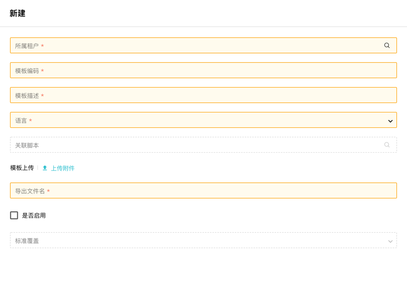
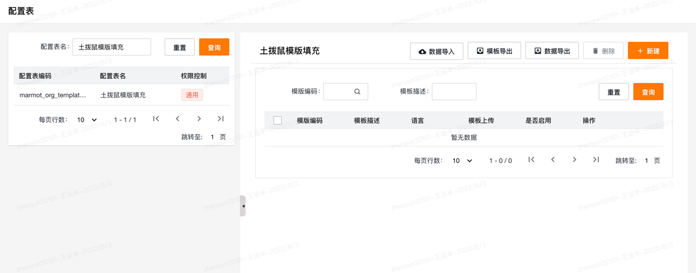
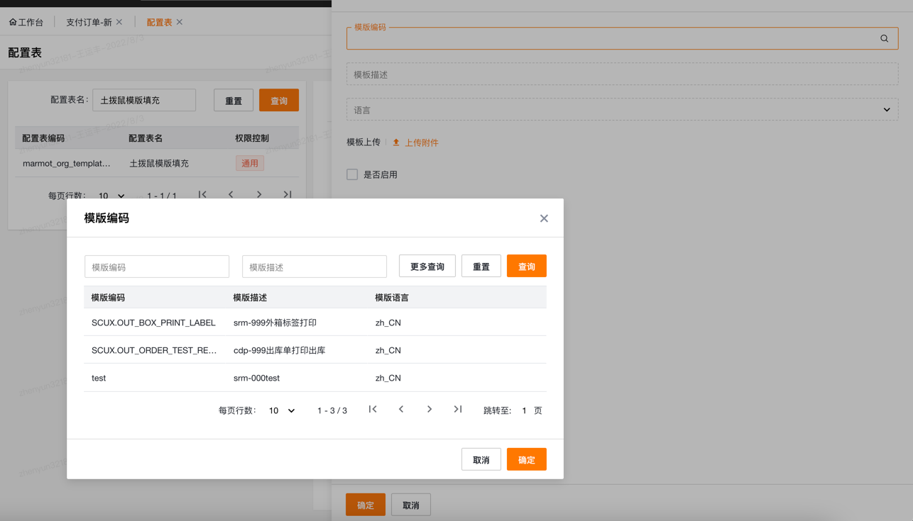
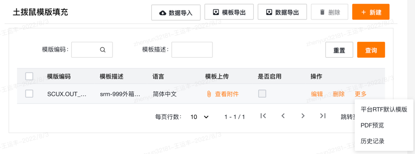
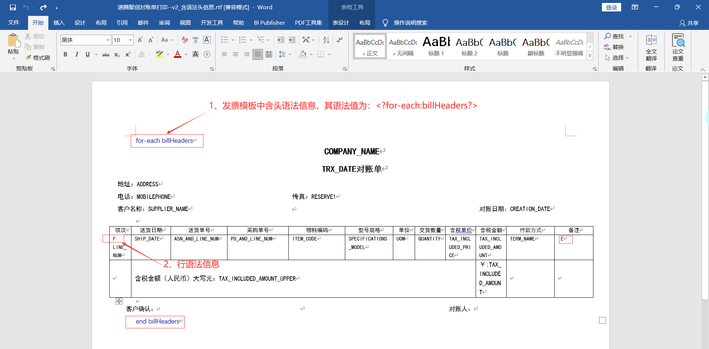
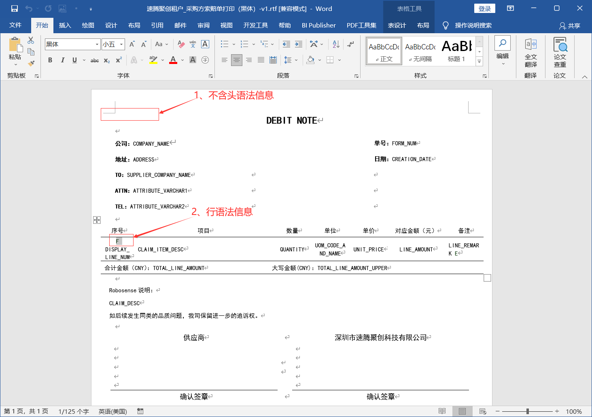
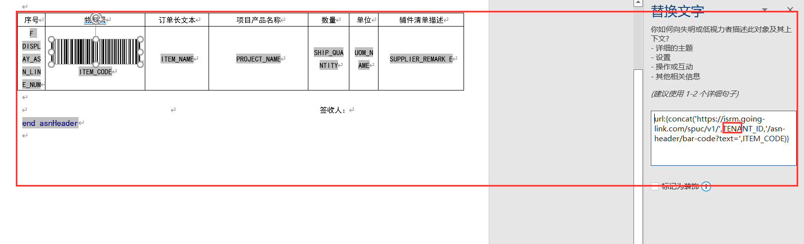

# 简介
基于独立脚本、rtf模版实现的PDF打印功能
## 目录

* [老功能无痕迁移](#老功能无痕迁移(后端))

* [新PDF打印需求](#新PDF打印需求（配置完成，前端可直接调用）)

* [工作流PDF展示](#工作流PDF展示（导出文件类型HTML）)

* [独立脚本编写](#独立脚本编写)

* [RTF模版个性化调整](#RTF模版个性化调整（业务操作）)

* [土拨鼠发票模板制作注意事项](#土拨鼠发票模板制作注意事项)

* [RTF模板开发语法](#RTF模板开发语法)
    * [分页](#分页)
    * [页眉页脚](#页眉页脚)
    * [图片插入](#图片插入)
    * [超链接](#超链接)
    * [复选框](#复选框)
    * [if语句](#if语句)
    * [排序](#排序)
# 老功能无痕迁移(后端)
注意、注意、注意！！！当且仅当使用`printHelper.printList`或`printHelper.print`方法实现的打印功能可进行迁移！！！
## 效果
无需修改代码以及走发布流程，即可实现或优化二开报表打印需求
## 实现方式
### 新建MarmotScript模板填充
    
   
1. 租户编码：选择该模板适用的租户  
2. 模板编码：   
   - 老功能迁移填写报表定义中的报表代码`reportCode`！！！  
   - 新功能根据需求自行编写  
3. 模板描述：描述信息（请带上需求号）  
4. 语言：上传的rtf模板适用的语言环境  
5. 关联脚本：关联独立脚本  
6. 模板上传：上传对应语言环境的rtf模板  
7. 导出文件名：  
   - 老功能迁移文件名无用，沿用代码中设置的文件名称！！！  
   - 新功能生效  
8. 是否启用：禁用则走老逻辑，启用则走新逻辑。  
9. 标准覆盖：仅展示作用，保存后会自动判断是否为标准覆盖功能。

# 新PDF打印需求（配置完成，前端可直接调用）

## 使用
上述配置完成（包括rtf模板配置、独立脚本编写）

### 单个PDF打印接口
1. 接口方法：POST  
2. 接口地址：`/marmot/v1/{organizationId}/marmot-report/print/{templateCode}`  
3. 接口参数：body中传入json对象  
   - 仅支持`{string:string,.....}`类型json对象  
   - body中所有参数仅供土拨鼠独立脚本使用，可在input中取用  
4. 打印类型：默认PDF文件。如需打印WORD文件，要在RTF填充菜单界面配置文件类型为word文件

### 批量PDF打印接口
1. 接口方法：POST  
2. 接口地址：`/marmot/v1/{organizationId}/marmot-report/print/list/{templateCode}`  
3. 接口参数：body中传入json数组  
   - 仅支持`[{string:string,.....},{}....]`类型json数组  
   - 会根据body中json数组循化调用脚本，最终进行组装打印。  

# 工作流PDF展示（导出文件类型HTML）
## 简介
工作流PDF展示，即为html浏览器页面展示PDF，所以其文件类型为HTML，其余配置项与上述PDF一致。
## 使用
- 完成RTF填充配置  
- 前端直接调用接口即可  
1. 接口方法：GET  
2. 接口地址：/hrpt/v1/{organizationId}/marmot-report/{templateCode}/data?+参数  
3. 接口参数：url路径上所有参数供土拨鼠独立脚本使用，可在input中取用  

注意，使用新接口可兼容老的PDF在HTML展示方案   
参数不变，仅需将reportuuid换成reportCode，并按上述接口地址请求即可。（会走数据集，报表定义那个方案）  

# 独立脚本编写
## 只有头信息
正常return即可  
## 头、行信息
参考报表定义中xml预览  
例如：
```xml
<?xml version="1.0" encoding="UTF-8" ?>
<DATA>
	<settleHeaders>
		头信息
		<settleLine>
			行信息
		</settleLine>
		<settleLine>
			行信息
		</settleLine>
		......
	</settleHeaders>
</DATA>
```
独立脚本编写为：  
```javascript
var header =  STD.QueryBlock.selectOne();
var lines =  STD.QueryBlock.selectList();
header.settleLine = lines;
return header;
```
注意：settleLine即为node中的节点名  
## 多头多行
参考报表定义中xml预览  
例如：  
```xml
<?xml version="1.0" encoding="UTF-8" ?>
<DATA>
	<billHeaders>
		<header>header</header>
		<billLines>
			<linel>line</linel>
		</billLines>
	</billHeaders>
	<billHeaders>
		<header>header</header>
		<billLines>
			<linel>line</linel>
		</billLines>
	</billHeaders>
</DATA>
```
独立脚本编写为：  
```javascript
var headers = STD.QueryBlock.selectList(); 
headers.forEach(function(e){
	//通过头中某些信息查行数据
	var lines =  STD.QueryBlock.selectList(e.id);
	e.billLines = lines;
});
result.billHeaders = billHeaders;
return result;
```
注意：billHeaders、billLines都为node中的节点名  
# RTF模版个性化调整（业务操作）

  
当开发人员在平台级创建并调整好之后。当客户有对RTF模版的调整（改调整不涉及数据的调整），业务人员可以在该菜单下进行操作而不需要让技术进行介入。  
## 操作流程：

  
1. 选择需要变更的模版编码  
2. 保存（不要点启动）  

3. 保存后可以点击更多获取到平台级的RTF模版  
4. 依据平台级的模版进行调整  
5. 后将调整后的模版进行上传  
6. 勾选启用，后保存  
7. 可以通过PDF预览进行查看效果  
## 注意事项
1. 租户下的个性化RTF模版的优先级高于平台级的RTF模版，  
2. 当后续需要技术介入修改时，业务需要提供个性化模版并关闭个性化模版填充配置。  
3. 技术基于该模版在进行调整和修改后在平台级上传。  
  
**不关闭个性化模版填充配置的话会导致技术在平台级的修改不生效。**
# 土拨鼠发票模板制作注意事项
## RTF文件含语法头
**该场景脚本编写需按照上述中多头多行格式进行编写**  

- RTF模板示意图   
   
   
- 需要注意的是：若发票模板中含一维码、二维码，那么RTF发票模板中，必须含头语法信息。一维码、二维码需要被**头语法信息--尾语法信息**包含，否则一维码、二维码将无法运行得到。  
- 详细案例：  
  https://lexiangla.com/teams/k100031/docs/df63ac18622a11ec8f8fc2e193d52d7f?company_from=d8d18c5a850c11eab17f5254002f1020  
## RTF文件不含语法头
**该场景脚本编写需按照上述中单头多行格式进行编写**  
- RTF模板示意图  
   
   
- **不含头语法信息的RTF文件，制造一维码、二维码会失效，实际运行后一维码、二维码不能在发票中显示出来。若想让一维码、二维码在发票中显示，需要使用含头语法信息的RTF文件。**  
- 详细案例：  
  https://lexiangla.com/teams/k100031/docs/bd6c3a8e622b11ec87785ad862b433f8?company_from=d8d18c5a850c11eab17f5254002f1020  

## 一维码｜条形码
地址案例：url:{concat('https://isrm.going-link.com/spuc/v1/',TENANT_ID,'/asn-header/bar-code?text=',DISPLAY_PO_NUM)}  
## 行一维码｜条形码
   
   
行数据上需要存在所需的所有参数即可  
按上图案例，行数据中需要同时拥有tenantId以及ITEM_CODE  
## 二维码
地址案例：url:{concat('https://dev.isrm.going-link.com/spuc/v1/13695/asn-header/qr-code?text=',BILL_NUM)}  


# RTF模板开发语法

## 分页

分组声明中加 @section

```text
<?for-each@section:G_PO_HEADER?> 。
```

例如

```text
<?for-each@section:printHeaderList?>
```

就可以实现每次循环printHeaderList是单独一个新页。

## 页眉页脚

1、  标准的页眉页脚，即单个页眉页脚，使用 Word的功能即可。

2、  扩展的页眉页脚，可使用如下把主体部分 “框 ”起来，凡是在这两个标记之外的东西，都将被当作页眉页脚。
```text 
<?start:body?><?endbody?>
```


## 图片插入

接插入图片，可以直接在模板中插入 jpg、 gif或 png格式图片

URL链接图片

- 在模板中随意插入一张图片

- 在设置图片对话框中的网站标签页中，在可选文字中输入如下的 URL格式链接

url:{’http://www.oracle.com/images/ora_log.gif’}


## 超链接

- 使用 word中的插入超链接功能来插入静态链接

- 如果超链接包括了模板中的数据元素，可以在运行时动态的创建超链接，在链接地址中按如下格式输入 {URL_LINK}

## 复选框

可以在模板中定义复选框，并根据传入的值来决定是否被选中  

定义复选框的步骤：  

- 使用 word中的复选框型窗体域功能添加复选框  

- 打开复选框型窗体域选项窗口  

- 设置默认值：未选中或选中  

- 在窗体域帮助文字中输入复选框选中的条件表达式，它必须是一个布尔表达式，只能返回 true或 false  

如： XML数据中包括了 ```<population>```的元素，如果 ```<population>```的值大于 10000 则复选框被选中，则在窗体域帮助文字中输入如下的条件表达式： 

```text
<?population>10000?>
```

## if语句

```text

<?if:condition?>

……

<?end if?>
```

例子

```text
<?if:VENDOR_NAME=’COMPANYA’?>

……

<?end if?>
```

## 排序

可以使用组中的字段对组进行排序，在组标记内插入如下的命令标记：  

```text
<?sort: VENDOR_NAME?>  
```

也可以对组中的多个字段进行排序： 

```text
<?sort:element name?><?sort:elementname?>……<?sort:VENDOR_NAME?> <?sort:INVOICE_NUM?>  
```