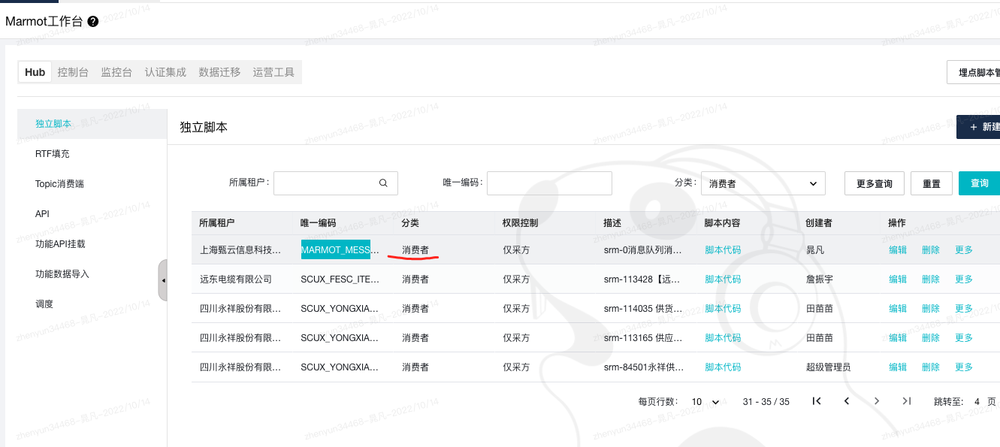
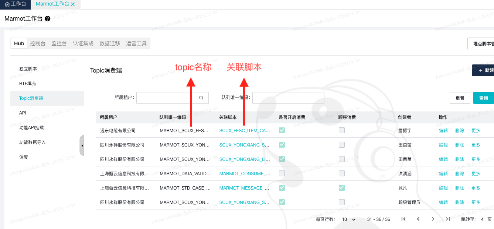

1.在配置表 独立脚本 中维护需要执行的JavaScript脚本代码


2.工作台 topic消费队列 中维护好需要发送的队列名称、租户编码以及Marmot脚本编码。


唯一编码：即MQ中的TOPIC，为了防止TOPIC重复，这里的唯一编码只能输入以MARMOT开头的字符串，建议规范命名。

同时由于DEV和TEST使用的是相同的MQ地址（PROD不同），所以使用时请注意区分环境，以免同名的Topic被不同环境消费

所属租户：对应的租户名称，通过此租户和脚本编码确定需要执行的土拨鼠脚本。

关联脚本：需要运行的脚本编码，需要和租户编码确定唯一。

是否开启消费：打开开关便开始消费未消费的消息，每隔五分钟扫描一次，扫描时会判断队列是否存在以及是否开启，如果删除了对应数据或者关闭了消费，则会取消订阅。意为如果对此进行修改，则最多需要等待五分钟便可生效。

顺序消费：是否开启顺序消费


3.维护好上述内容，可以使用在MarmotScript中使用对应模块api发送消息，如下代码：
```javascript
//queue详情使用见文档2.8.25
let queue = require("@M/v1/queue");
queue.produce({topic:"MARMOT_STD_CASE_QUEUE_TEST", body:{"tmpObj":"test"}});
```

4.发送消息会根据队列对应的脚本编码和租户编码找到Marmot独立脚本以执行，如果脚本执行报错会暂挂五分钟，五分钟后会重试。参数需要json格式，若参数不对，则发送出的消息会打印错误日志并消费掉，不会暂挂）